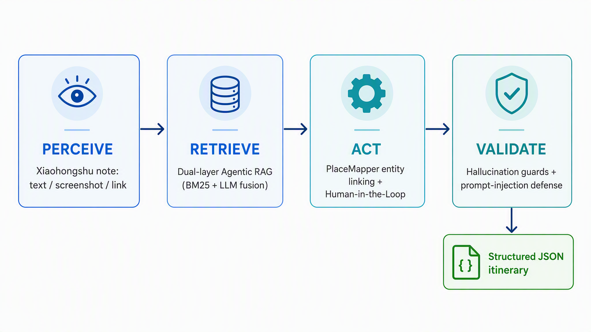

# 01 · 旅行笔记提取 Agent

刷到一篇写得很好的小红书游记,想把它变成自己能直接用的行程表,通常得手动摘抄:哪天去哪、吃什么、住哪。这个 Agent 把这件事自动化了。你把游记(文字、截图或分享链接)丢给它,它还你一份结构化、可校验的每日行程 JSON。

## 它是怎么工作的

它不是"把文本喂给大模型,让它吐个 JSON"那么简单。那种做法在真实输入面前会各种翻车:地名被翻译两遍导致漂移、模型编造原文里没有的城市、遇到无关内容也硬要输出。我把它拆成了一个像认真助理一样的四步流程:

1. **感知(Perceive)**:先看懂你给的是文字、截图还是链接,并判断这到底是不是一篇行程类内容。不是的话,在花钱调大模型之前就早退。
2. **检索(Retrieve)**:从一个北海道旅行知识库里找相关背景,帮它读懂那些口语化的地名。
3. **行动(Act)**:把"洞爷湖万世阁大浴场"这种带描述的说法对齐到标准地点。拿不准的,交给人确认,不瞎猜。
4. **校验(Validate)**:输出前自查。天数合不合理?有没有编出原文没有的城市?不靠谱的结果直接拦下来。

## 我在这个项目里做的权衡

这是四个项目里最接近"真实 AI 产品"的一个,因为它逼我处处做取舍,而不只是让 demo 跑通:

- **不让模型乱翻译地名。** 中文地名一律保留原文,靠一个专门的地点映射器(PlaceMapper)做唯一真相来源。线上系统里"翻译两次导致语义漂移"是很常见的坑,我从架构上把它堵死了。
- **省 token 是产品决策,不是抠门。** 遇到无关或含糊的输入,在调用大模型之前就拒掉;检索层完全不做向量化,省掉 embedding 的开销。成本意识贯穿整个设计。
- **人机协作只在关键处触发。** 交通、购物、明显是中转的条目自动跳过,只把"真正需要人判断"的抛给用户确认,尽量少打扰。
- **把"负责任 AI"做成能跑的测试,而不是口号。** 内置了 6 条幻觉护栏、提示注入攻击测试(有人故意输入"忽略以上所有指令"),还做了有无示例的对照实验来量化效果。

我关心的从来不只是"能不能跑通",而是"上线之后会不会出问题、贵不贵、烦不烦用户"。

## 技术实现

- **双层 Agentic RAG(零 embedding)**:Layer 1 用 BM25 从 6 个知识块检索(k1=1.5, b=0.75);Layer 2 把检索结果当作"参考引用"而不是"指令"融进 prompt,这本身也是一层间接的提示注入防御。Agent 会按输入类型决定要不要检索:文字走双层,链接先解析再走文字流,图片走多模态、跳过 RAG。
- **三层实体链接(PlaceMapper,同样零 embedding)**:精确匹配(置信度 1.0)→ 别名匹配(0.9)→ 模糊匹配(difflib, cutoff 0.6);配合预处理剥掉括号和 19 种描述性后缀。知识库 76 条目。
- **Schema 锁定输出**:Gemini 2.5 Flash + JSON mode + temperature 0.1,指数退避重试 3 次(2s → 4s → 8s)。
- **可观测性**:每次调用都记录 token 消耗、检索文档数、校验告警,给团队的观测模块留了 hook。

## 文件

| 文件 | 说明 |
|------|------|
| [`travel-agent-slides.pptx`](./travel-agent-slides.pptx) | 完整设计说明 |
| [`travel-agent-code.ipynb`](./travel-agent-code.ipynb) | Agent 实现代码 |
| `assets/demo_run.png` | 真实游记的运行结果 |

> 本项目为多人团队的多 Agent 系统协作,我负责其中的旅行笔记提取 Agent:完整的四阶段循环、双层 Agentic RAG、PlaceMapper、人机协作过滤、输出校验器,以及两项负责任 AI 评估测试。
>
> **AI 工具声明**:Agent 底层模型为 Google Gemini 2.5 Flash(课程提供);代码由本人编写并验证,ChatGPT / Claude 仅用于代码审查与文档润色;测试用的北海道游记为公开内容,不含隐私或版权信息。
