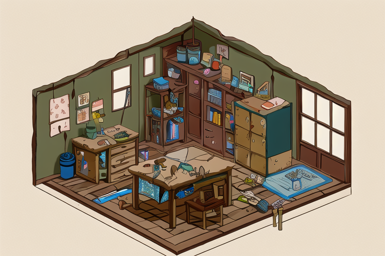
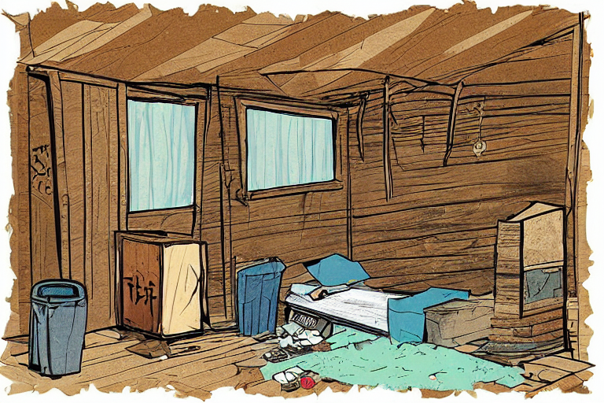
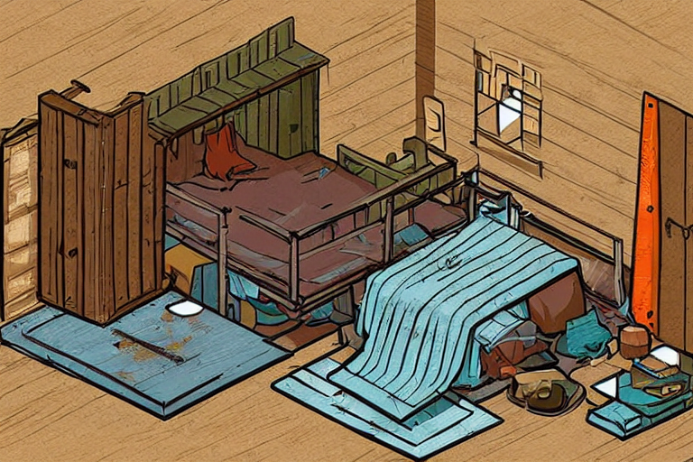
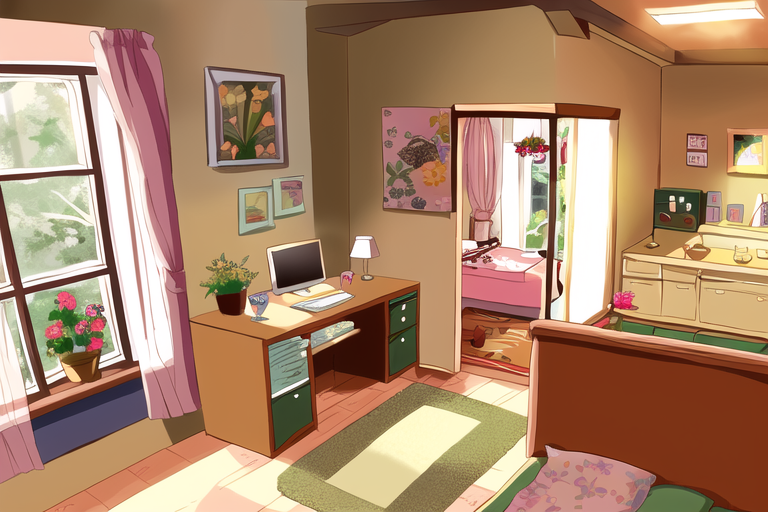

# 02 · 游戏美术 AI 生产管线

我在做一款独立游戏《攒钱逃离贫穷》,画风是俯视 45° 的等距房间,要随剧情从"破败"一路演变到"奢华"。作为个人开发者,手绘每张素材太慢,长周期里也很难保持画风统一。于是我训练了一个专属画风的 LoRA 模型,搭了一套生图工作流,然后老老实实回答了一个产品问题:**它到底能不能替代画师上生产?**

## 我做了什么

我只用 **28 张参考图**训了一个画风模型 `smf_iso_style`,让 AI 学会我要的那套视觉语言:黑色描边 + 平涂着色 + 45° 等距透视。然后在 ComfyUI 里搭了一套"生图 + 局部重绘(inpainting)"的工作流,可以往一个空房间里精准补一张床,而不破坏画面其余部分。

下面是同一画风下"贫穷 → 小康 → 奢华"三档房间:

| 贫穷 | 进阶 | 奢华 |
|------|------|------|
|  |  |  |

## 我的结论是克制的

很多人会把"AI 能生成好看的图"当成终点。我做了一遍完整的成本收益核算,结论反而是:**这套管线现在只适合做原型,还不能做成品。** 三个具体判断:

- **"看起来高效"不等于"真的高效"。** 模型经常搞坏空间逻辑或线条,我得生成一大批再筛出一张能用的。把提示工程、搭工作流、手动修图的时间全算进去,短期内比直接约一位画师还慢。
- **它真正的甜区是"动态灵感板",不是"成品打印机"。** 在早期低成本地探索房间布局和氛围,这件事它做得很好。
- **可靠性是产品化的门槛。** prompt 一复杂,它就丢掉 45° 透视;画室外场景和人物直接崩坏。我把这些失败逐条归因(数据集全是室内、几何约束和人体曲线冲突……),指出真正缺的是**原生的几何控制**和**可复用的模块化画风系统**。

我觉得一个 AI PM 最重要的能力之一,是在技术看起来很酷的时候依然敢说"它还不够好",并且说清楚差在哪、怎么补。这个项目就是这种判断力的证据。

## 技术实现

训练配置(SD 1.5 底模,生态成熟、对硬件友好,适合个人开发者。因为本机显存不够,是租了一台 RTX 4090 云服务器跑的):

| 项 | 值 |
|------|------|
| 底模 | Stable Diffusion 1.5 |
| LoRA rank | 16 |
| Batch size | 4 |
| 训练步数 | 1600 |
| Unet 学习率 | 1e-4 |
| Text Encoder 学习率 | 1e-5(压低,避免破坏语言理解能力) |
| 调度 | 10% warmup + cosine decay |
| 优化器 | AdamW8bit |
| 其他 | 开启 bucketing 处理多种宽高比 |

- **数据策略**:28 张手工筛选的等距房间图,统一 anime/game 画风。触发词 `smf_iso_style` 前置,内容标签分层(lv1/lv2/lv3)+ 画风锚点(dark lineart, flat color),刻意把"内容语义"和"视觉风格"解耦。
- **权重扫描**:做了 0 → 0.5 → 0.8 → 1.2 的权重对比,定位到 **0.8 是甜点**(到 1.2 时线条会"碳化",明显过拟合);另外在 AnythingV5 上做了跨底模鲁棒性测试。
- **工作流**:ComfyUI 并行双链——标准生成链 + 按需触发的 inpainting 链。局部修正时手动画 mask,denoise 设 0.75~0.85,在灵活性和 GPU 效率之间取平衡。
- **失败分析**:系统梳理了画风漂移、几何不稳、caption 依赖、底模不兼容、权重饱和这五类问题的根因。

> 报告里有完整的超参配置、生成图对比、失败案例和成本反思;训练出的 `.safetensors` 权重因显存限制未随仓库附带,但复现所需的全部配置都在上面这张表和报告里。

## 文件

| 文件 | 说明 |
|------|------|
| [`lora-workflow-report.pdf`](./lora-workflow-report.pdf) | 完整报告(含大量生成图、对比实验、失败案例、成本反思) |
| `assets/` | 精选生成美术 |

> 本项目为个人独立完成,包括数据准备、模型训练、工作流搭建、实验分析与结论。
>
> **AI 工具声明**:训练素材来自公开来源与游戏美术参考,已做去水印等清洗处理。
