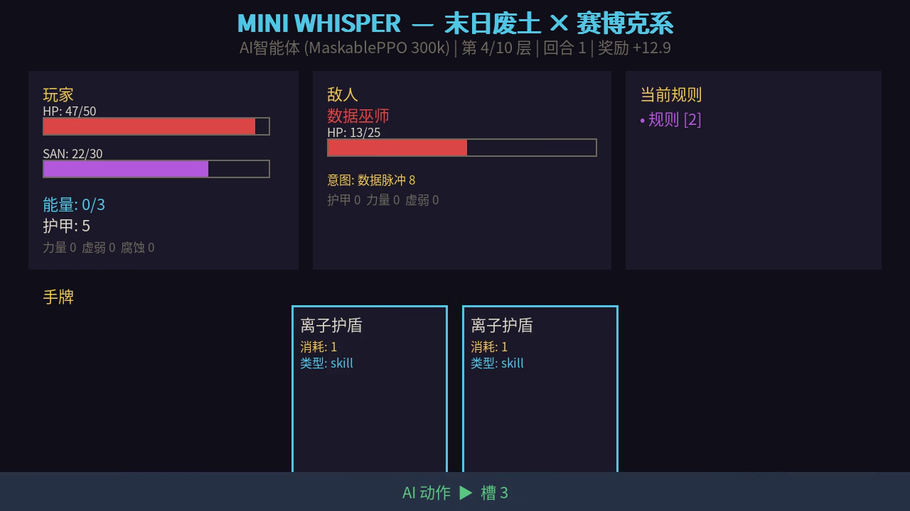
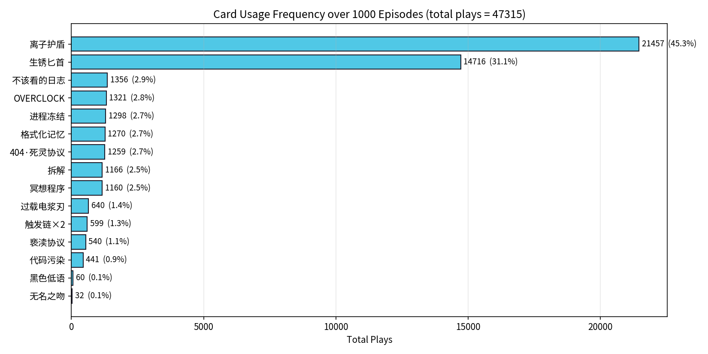
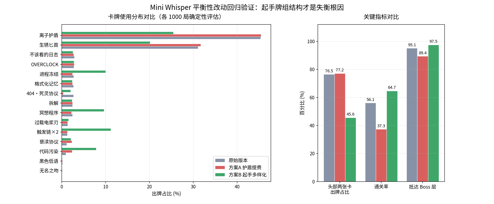

# 03 · 用强化学习智能体审计游戏平衡性

我做了一款卡牌爬塔小游戏,然后训练了一个 AI 让它自己去打。真正的目的不是"让 AI 会玩",而是想实验:**用智能体反复通关来暴露出我自己没发现的设计问题** 也就是训练一个智能体来进行自动测试，结果它确实做到了,而且只花了 138 秒。

## 游戏和 AI

《Mini Whisper》是一款"末日废土 + 赛博克系"风格的卡牌游戏:10 层楼、6 种敌人、15 张卡、6 条核心规则。我用 sb3-contrib 的 MaskablePPO 训练了一个智能体,在单张免费的 Tesla T4 上跑了 **4.4 分钟**、30 万步就收敛了。1000 局确定性评估下来,它在 **95.1%** 的对局里能打到 Boss 层,**56.1%** 直接通关,平均奖励 49.5,比我自己手玩的基线高出约 22%。

主要的核心结论是下面这张图。

我统计了 AI 一千局里每张卡打出的次数,分布极度倾斜:**两张卡吃掉了 76% 的出牌量,另外两张几乎从没被打出(不到 0.15%)。** 很显然在设计的时候卡牌非常不均衡，有些卡强到离谱,有些卡等于废牌,而这个结论是 AI 用行为投票投出来的，代替了人类手动测试的部分。

## 项目收获

一个智能体在几十万步里被逼着找最优解,会直接放大设计里的漏洞、ai诚实地无视了一些看起来很酷但其实没用的机制。这正是人工试玩最难做到的——人有惯性、有偏好、会照着设计者的意图玩。AI 不会。基于它的行为,我给出了两条初步的设计改动假设:

- **"离子护盾"疑似过强。** AI 自己发现了一个"护盾 → 拆解 → 格式化记忆 → 再上护盾"的循环,能把绝大部分伤害清零。第一反应是把它的费用从 1 提到 2。
- **有两张卡是"死卡"。** "黑色低语"和"无名之吻"合计只占 0.2% 的出牌。它们的设计是用理智换伤害,但 AI 判断在任何它能走到的局面下这笔交易都不划算,所以直接不用。它们不是难用,是被其他卡严格支配了。

同样的统计置信度,靠人工试玩要攒好几周。AI 的 1000 局评估只用了 138 秒。在游戏测试中，ai把"凭手感调平衡"变成了"拿数据说话"。

## 改动验证:第一个方案是错的

上面两条只是假设。我把它们实装、重新训练、用同一套协议做了对照评估,结果推翻了自己的判断。

**给离子护盾加费用完全无效。** 费用从 1 提到 2 之后,它的出牌占比是 45.44%,相比基线的 45.35% 纹丝不动——AI 依然把它当最优解,只是每回合能做的事变少了。代价是通关率从 **56.1% 崩到 37.3%**,还多出一张新的死卡。没有修复倾斜,只把游戏变难了。

这个反常现象反推出一个新假设:出牌集中也许根本不是卡强度问题,而是**起手牌组就是 5 张匕首 + 5 张护盾,手里压根没有别的牌可打**。于是第二组实验只改初始牌组构成、一个数值都不动:

**头部两张卡占比从 76.5% 降到 45.6%**,触发链、进程冻结、冥想程序、代码污染四张原本 1–3% 的卡回到 8–11% 的健康区间,**且通关率不降反升(56.1% → 64.7%)**,难度曲线没被破坏。

修正后的结论:**卡牌使用倾斜的主因是牌组结构,不是单卡强度。直接调数值不仅纠不了偏,还会顺手破坏难度曲线。** 评估平衡性改动必须同时盯出牌分布和通关率两个指标,只看前者就会得出第一组那样的错误判断。

完整实验设计、数据与复现步骤见 [`experiments/`](./experiments)。

## 技术实现

- **环境**:自己用 Gymnasium 写的卡牌环境。51 维观测、16 路离散动作,带非法动作掩码(所以用的是 MaskablePPO 而不是原版 PPO)。奖励函数是手工设计的稠密奖励,特意加了理智损失惩罚,防止 AI 学出"自杀式高伤"的畸形打法。
- **算法**:MaskablePPO + 2 层 MLP [128, 128],4 个并行环境,30 万步。单卡 T4,约 1100 env-steps/s,4.4 分钟收敛。
- **收敛诊断**:approx_kl、clip_fraction、entropy_loss 三项指标都健康,从探索到利用的过渡很平滑,没有出现策略过早坍缩。
- **评估**:1000 局用的种子是 20000–20999,训练时完全没见过,避免数据泄漏。奖励分布是明显的双峰,精确对应"打到 Boss 但输了"和"通关"两种结局。

代码里带了完整的单元测试(`test_env.py`、`test_cards.py`、`test_enemies.py`、`test_rules.py`),环境、卡牌、敌人、规则四块的逻辑都覆盖到了。

## 文件

| 文件 | 说明 |
|------|------|
| [`mini-whisper-report.docx`](./mini-whisper-report.docx) | 完整报告(奖励设计、训练曲线、逐层行为分析、两条设计发现) |
| [`mini-whisper-slides.pptx`](./mini-whisper-slides.pptx) | 演示文稿 |
| [`code/`](./code) | 全部源码:环境、训练、评估、行为分析脚本 + 单元测试 |
| [`model/final_model.zip`](./model) | 训练好的模型权重 |
| [`results/`](./results) | 初版评估图表、runs.csv、summary.json |
| [`experiments/`](./experiments) | 改动回归验证:两组对照实验的 patch、权重、评估数据与复现脚本 |
| [`demo.mp4`](./demo.mp4) | 90 秒演示视频 |

> 本项目为个人独立完成,涵盖游戏设计、环境搭建、RL 训练与行为分析。代码、模型、评估数据集和演示视频均可复现。
