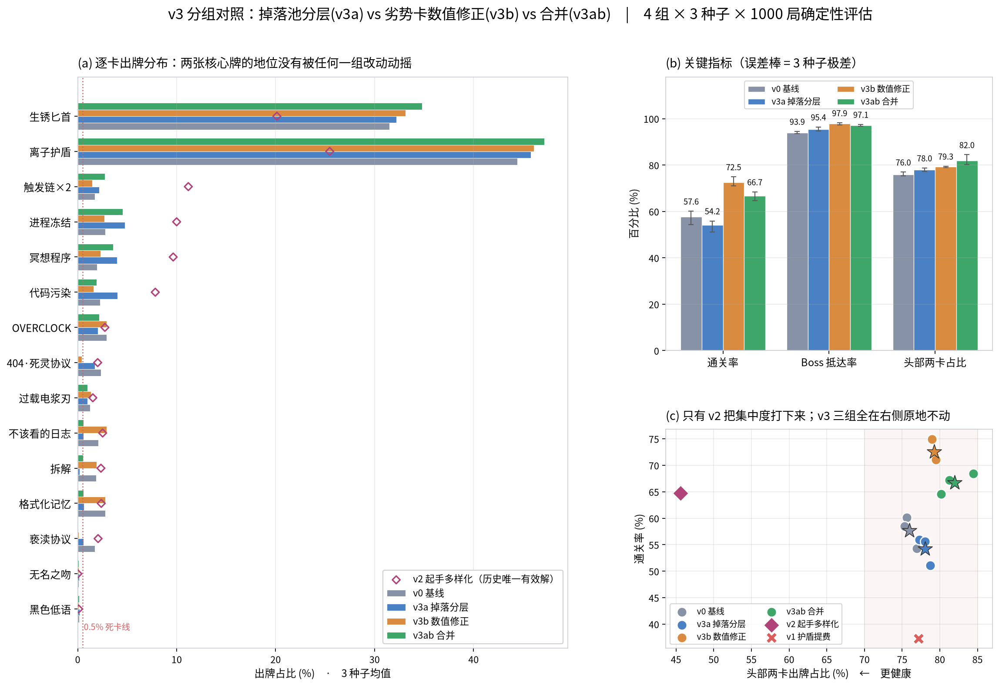
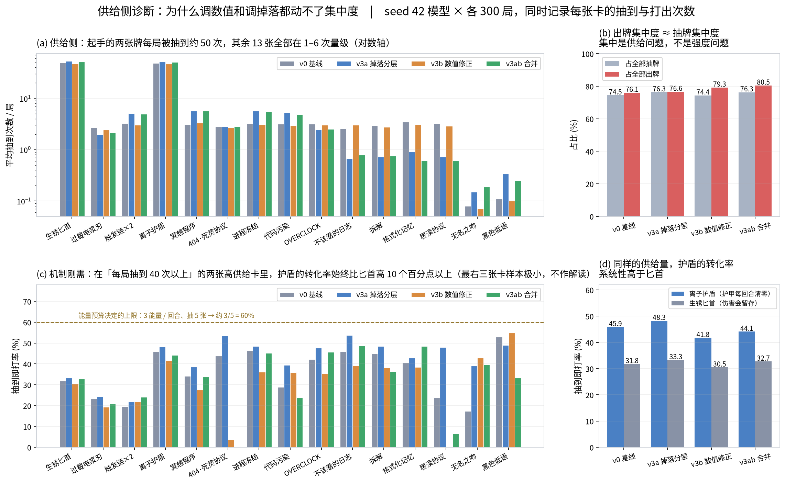
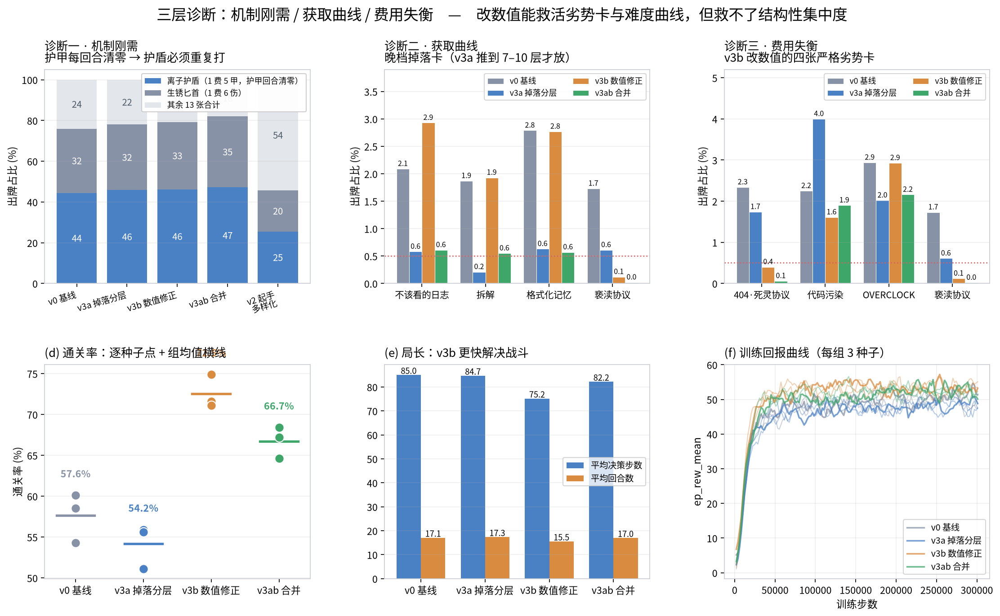

# 掉落机制与数值修正的三种子验证（v3 补充实验，4 组 × 3 种子 = 12 次训练）

v2 那轮我以为找到了根因，把结论写成了「使用倾斜的主因是起手牌组构成」。这一轮是来推翻那句话的。

**结论先行：v2 的归因是错的，而 v3 三个修法也全都失败了。四个版本没有一个降低出牌集中度——在这一轮里，通关率越高的版本反而越集中（12 次运行内 r = +0.52）。** 但把 v1 / v2 两个历史锚点放进同一张散点图，这个相关性就消失了（15 点 r = 0.03）。所以不能说「越好打越集中」是条规律，只能说**集中度和难度是两个可以各自移动的维度，而 v3 这三组只推动了难度，一次都没碰到集中度**。

根因比我以为的更靠前一层：不在掉落池的**范围**，在掉落**不是一个决策**。这一轮我补了一个供给侧测量把它量了出来——**出牌集中度几乎就等于抽牌集中度**（74.5% vs 76.1%），头部那两张卡每局被抽到约 50 次，其余 13 张全部在 1–6 次量级。集中不是「这两张卡太强」，是「牌库里几乎只有这两张卡」。

## 为什么要推翻 v2

v2 的改动是把初始牌组从「5 匕首 + 5 护盾」换成 6 类卡混合，指标确实好转（集中度 76.5% → 45.6%，通关率 56.1% → 64.7%）。但这一轮回头看，那个结论有两个问题。

**第一，它绕过了根因而不是修复了根因。** 真正让牌组趋于噪声的是战斗后的掉落逻辑：`_post_combat_reward()` 用 `rng.choice(get_loot_pool())` 每层随机塞 1 张进牌组，全程不看层数。v2 把 4 张卡直接放进起手，等于在掉落随机性**之前**先把牌塞进手里，掉落那套机制一行没动。指标好转是因为绕过了它，不是因为解决了它。

**第二，它拆掉了一个原本正确的设计。** 初始牌组只有两类卡是有意为之——爬塔类游戏的构筑乐趣建立在「起手很窄，靠过程变宽」上。v2 为了压一个指标把起手直接开宽，代价是构筑深度被抽掉，而这个代价在集中度和通关率两个指标上都看不见。

**第三，v2 的效应量本身不够可信。** 这一轮我把基线用 seed 42 / 7 / 123 各跑了一次，通关率是 60.1% / 58.5% / 54.3%——**基线自身的种子极差就有 5.8 个百分点**。v2 相对基线三种子均值（57.6%）的 +7.1pt，只比这条噪声底线高一点点，单种子跑一次根本不足以支撑「找到根因」这种强度的结论。这是这一轮最先教给我的东西。

## 实验设计

四组 × 3 个随机种子（42 / 7 / 123）= 12 次独立训练，每次 30 万步；每个模型各跑 1000 局确定性评估（种子 20000–20999，训练时未见过）。seed 42 是第一轮先跑的，7 / 123 是补的稳健性检查——先有单种子结论、再用两个新种子验证，顺序本身也是这一轮想练的东西。

评估协议的可复现性顺手验了一次：8 个多种子模型被两条互不相干的执行链各评了一遍 1000 局，12 项指标逐个比对**完全一致**，所以下面所有差异都不是评估随机性带来的。

| 组别 | 改动内容 | patch |
|------|----------|-------|
| v0_repro | 无改动，基线复现 | — |
| **v3a** 掉落分层 | 掉落池按楼层分档放开：1–3 层只有 6 张基础牌，4–6 层加入 3 张中高费卡，7–10 层才放开格式化记忆 / 亵渎协议 / 拆解 / 不该看的日志 | [`v3a_loot_tier.*.diff`](patches/) |
| **v3b** 数值修正 | 按「每费伤害」重算三张废卡：404·死灵协议 9→13、代码污染 5→7、亵渎协议 8→15；同一个 patch 里还降了两张卡的费用：OVERCLOCK 2→1 费、格式化记忆 1→0 费。⚠️ 这一组不是单变量：5 处改动同时落地，所以「+14.9pt 来自哪一处」无法从本实验分离，这是我这轮的设计缺陷。 | [`v3b_card_stats.cards.diff`](patches/) |
| v3ab | 两者叠加 | 两个 patch 同时打 |

先澄清一句：原版游戏里不存在按层解锁——`cards.py` 注释里的 M1 / M2… 只是卡牌命名批次，`loot_only` 字段没有任何代码读取（是我留下的死标记）。分档是 v3a 这个 patch 新引入的机制，它的排序依据是「这张卡是否需要成型牌组才敢要」。例如格式化记忆的效果是从牌组里移除卡，在只有 10 张基础牌时它移除的只能是匕首或护盾，是纯负面；只有牌组被掉落撑厚、混进废牌之后它才变成解毒剂。所以它必须晚放。

## 结果



先看三个种子取平均之后的总表（逐种子明细在 [`results/summary_all.md`](results/summary_all.md)）：

| 指标 | v0_repro | v3a 掉落分层 | v3b 数值修正 | v3ab 叠加 |
|------|----------|-------------|-------------|-----------|
| 通关率 | 57.63% | **54.20%**（−3.4pt） | **72.53%**（+14.9pt） | 66.73%（+9.1pt） |
| Boss 抵达率 | 93.90% | 95.40% | 97.90% | 97.07% |
| 头部两卡出牌占比 | 75.97% | **78.02%**（+2.1pt） | **79.26%**（+3.3pt） | **81.97%**（+6.0pt） |
| 离子护盾单卡占比 | 44.45% | 45.81% | 46.12% | 47.16% |
| 出牌占比 <0.5% 的死卡 | 2.0 张 | 3.0 张 | 4.0 张 | 4.3 张 |
| 评估平均奖励 | 50.05 | 48.80 | 54.80 | 52.87 |
| 平均决策步数 | 85.02 | 84.69 | **75.15** | 82.19 |
| 平均回合数 | 17.07 | 17.33 | **15.53** | 16.96 |
| 训练末 ep_len_mean | 87.70 | 88.90 | 76.43 | 85.90 |
| 训练末 ep_rew_mean | 49.20 | 47.90 | 53.93 | 51.17 |

三个种子各自的结果（用来判断差异有没有超出噪声）：

| 指标 | v0_repro | v3a 掉落分层 | v3b 数值修正 | v3ab 叠加 |
|------|----------|-------------|-------------|-----------|
| 通关率 (s7 / s123) | 58.5% / 54.3% | **55.6% / 51.1%** | **71.6% / 71.1%** | 68.4% / 64.6% |
| 头部两张卡占比 | 75.3% / 76.9% | **78.1% / 78.7%** | **79.3% / 79.5%** | **84.4% / 80.2%** |
| 抵达 Boss 层 | 93.7% / 93.5% | 96.4% / 95.2% | 98.2% / 97.3% | 97.5% / 96.8% |
| 平均奖励 | 50.6 / 48.7 | 49.4 / 47.7 | 54.7 / 54.7 | 53.6 / 51.9 |
| 平均决策步数 | 89.4 / 81.6 | 84.9 / 82.4 | **74.0 / 77.6** | 86.1 / 78.5 |

先看可信度：**v3b 的效应是真的**，三个种子分别是 74.9 / 71.6 / 71.1，组内极差 3.8pt，小于基线自身的 5.8pt；逐种子增幅 +14.8 / +13.1 / +16.8pt，方向一致。v3a 的失败也在三个种子上方向一致。这就是多种子的用处——它给出了一条噪声底线，让我能判断多大的变化才算变化。

### v3a：分层失败，但失败的原因不是「分层无用」

集中度反而从 75.3–76.9% 升到 78.1–78.7%，通关率掉了约 3pt。更能说明问题的是那几张被延后的卡：

| 卡（s7 / s123） | v0_repro | v3a |
|----|----------|-----|
| 拆解 | 2.31% / 0.64% | **0.03% / 0.02%** |
| 格式化记忆 | 2.78% / 2.77% | 0.63% / 0.59% |
| 亵渎协议 | 2.62% / 1.31% | 0.63% / 0.56% |
| 不该看的日志 | 1.55% / 2.00% | 0.60% / 0.48% |

我本来想让它们「晚点再出现」，实际效果是让它们**几乎不再出现**。算一下就清楚了：7 层才放开，每层只掉 1 张，到 Boss 最多进 4 张，而此时牌组已经 16 张以上，抽到的概率极低。

**这些卡不是「晚点才强」，是「晚点等于没有」。** 分层这个方向本身没问题，是我把档位切得太晚，没有考虑剩余局长里还剩多少次掉落和抽卡机会。

### v3b：数值不是这里的杠杆——被加强的卡使用率反而暴跌

这是这一轮最反直觉的结果。

| 卡 | 改动 | v0_repro | v3b | v3ab |
|----|------|----------|-----|------|
| 404·死灵协议 | 9 → 13 伤（+44%） | 2.85% / 1.38% | 0.95% / **0.05%** | 0.08% / 0.08% |
| 亵渎协议 | 8 → 15 伤（+87%） | 2.62% / 1.31% | 0.18% / 0.14% | **0.00% / 0.00%** |

伤害提了近一倍，使用率掉到零。原因在局长：v3b 的平均决策步数从 85.5 降到 75.8，s7 上回合数从 17.7 降到 15.2。**加强让局变短，局变短意味着抽卡次数更少，非核心卡的出场机会被进一步挤掉。**

所以：**这些卡不被使用的原因不是数值弱，而是牌位、能量和抽卡机会。**「每费伤害」算的是打出来之后的效率，而它们的瓶颈发生在打出来之前。在这个结构下，数值平衡根本不是可用的杠杆——它只能让局面更快结算，反而加剧倾斜。

（一个诚实的边界：v3b 同时改了 5 处——三张卡的伤害加 OVERCLOCK / 格式化记忆两张卡的费用——局长也同时变短，严格说「是抽卡机会而非数值」这个归因没有完全分离变量。要干净地证明它，需要一个控制局长的实验，我没有跑。）

### v3ab：两个都改，集中度最高

84.4% / 80.2%，是全部八次里最集中的，而通关率（68.4% / 64.6%）反而低于 v3b 单独改。两个方向叠加没有互补，只是把牌组进一步推向「靠最稳两张结算」。

## 根因需要再往前一层

四个版本都动了同一类东西：**掉落池里有哪些卡**。没有一个动了**掉落是怎么发生的**。

`rng.choice(loot_pool)` 是「随机塞给你 1 张」。智能体对自己的牌组构成**没有任何决策权**——它不能选、不能拒、不能规划。既然构筑不是一个决策，牌组就必然趋向噪声，而对噪声牌组的最优策略只能是退回初始那两张稳定牌。

**只改池子范围而不改这一点，集中度当然不动。** v3a 的失败恰好把这件事证明了：它是「范围假设」最认真的一次实现，而它失败了。

真正的修法是照《杀戮尖塔》做 **3 选 1**：每层给三个候选、由智能体挑一张。这才是「构筑路径存在」的最小条件。它需要改动作空间与观测空间、重写动作掩码并重训，尚未实现。

## 把「掉落不是决策」量出来：三层诊断

上面那句「牌组趋向噪声」原本只是推理。这一轮补了一个供给侧测量把它变成数字：`scripts/eval_draw_play.py` 在评估时同时记录每张卡**被抽到**和**被打出**的次数，于是多了一个指标——

> **抽到即打率 = 打出次数 / 抽到次数**。它把「供给多」和「真的抢手」分开了：出牌占比高可能只是因为牌库里全是它，抽到即打率高才说明智能体没有取舍空间。

四个版本各 300 局（seed 42 模型）：

| 版本 | 头部两卡占**抽牌** | 头部两卡占**出牌** | 其余 13 张抽到次数/局 | 护盾抽到即打率 | 匕首抽到即打率 |
|------|------------------|------------------|--------------------|--------------|--------------|
| v0_repro | 74.5% | 76.1% | 0.08 – 3.47 | **45.9%** | 31.8% |
| v3a | 76.3% | 76.6% | 0.15 – 5.73 | **48.3%** | 33.3% |
| v3b | 74.4% | 79.3% | 0.07 – 3.31 | **41.8%** | 30.5% |
| v3ab | 76.3% | 80.5% | 0.19 – 5.67 | **44.1%** | 32.7% |



**出牌集中度几乎就等于抽牌集中度。** 头部两张卡每局被抽到约 50 次，其余 13 张全部在 1–6 次量级——集中不是「这两张太强」，是「牌库里几乎只有这两张」。这条等式解释了为什么改数值、改掉落池范围都没用：它们都没有改变谁在被抽到。

在这个基础上，三个层次的问题可以分开讲，而且各自对应不同的修法：



**第一层 · 机制刚需（护盾为什么压不下去）。** `env._start_turn()` 里有一行 `self.player["armor"] = 0`——护甲每回合清零。伤害会留存（打出去就记在敌人身上，只在敌人残血时溢出），护甲不会。所以护盾是「每回合都要重新买的消耗品」，也是多余能量的默认去处。数据上：**同样每局被抽到约 50 次，护盾的抽到即打率比匕首高 11–15pt，四个版本无一例外。** 这一层不是数值问题，改数值和改掉落都碰不到它；要动只能改机制（护甲留存 / 上限衰减 / 让防御有触发条件）。

**第二层 · 获取曲线（掉落全随机抹平了强度曲线）。** 掉落是每层 `rng.choice(loot_pool)` 随机塞 1 张，全程不看层数，于是 13 张非起手卡的供给被压成一条平线，每张每局只被抽到 1–6 次。v3a 是对这一层最认真的一次修，结果只是**把尾部的钱在尾部里挪了个位置**：早档卡涨（进程冻结 2.80% → 4.77%、代码污染 2.25% → 4.00%），晚档卡崩（格式化记忆 2.79% → 0.63%、拆解 1.87% → 0.21%），死卡从 2 张变 3 张，头部一动不动。原因是「档位太晚 + 每层只掉 1 张」：7 层才放开的卡最多只有 4 次进牌组的机会，而此时牌组已经 16 张以上。

**第三层 · 费用失衡（严格劣势卡）。** 在 3 能量 / 回合的粒度下，一张 2 费卡必须明显强过「两张 1 费卡」才有位置。v3b 把 404·死灵协议提到 13 伤（6.5/费）、亵渎协议提到 15 伤（7.5/费），都超过了基础卡的 6.0/费，结果**使用率反而崩了**：404 从 2.34% → 0.40%，亵渎从 1.73% → 0.12%（v3ab 里直接归零）。原因藏在同一个 patch 里：OVERCLOCK 从 2 费降到 1 费，而它的 +3 是**对本回合每一张攻击卡各加 3**，于是「多张低费攻击」的边际收益被系统性抬高，单张高费攻击被彻底挤出。**改一张卡的费用，改掉的是整个费用档的相对经济**——这是这一轮最反直觉的一条。

顺带划一条口径边界：只在掉落里出现的卡（404 / 亵渎 / 拆解这类）每局只被抽到约 3 次，1000 局评估下单卡使用率的方差很大，**不该用「出牌占比」单独给它们下结论**。这也正是加入抽到即打率的理由——它把供给差异除掉了。

## 这一轮的方法论收获

1. **能改善指标的干预，不等于归因正确。** v2 两个指标都变好了，但它绕过了根因。对照实验能证伪一个假设，却不能证明一个成功干预的解释是对的——这两件事我在 v2 那轮混为一谈了。
2. **必须先量出噪声底线，再谈效应。** 基线自身的三种子极差是 5.8pt。任何小于这个量级的「改善」都不该被当作结论，而 v2 的 +7.1pt 只比它高一点点。反过来，v3b 的 +14.9pt 在三个种子上分别是 +14.8 / +13.1 / +16.8pt，**方向一致、量级远超噪声**，这才是可以下结论的效应。
3. **指标本身要能区分成因。** 「出牌占比」把「供给多」和「真的抢手」混在一起了，所以它没法回答护盾为什么压不下去。补一个抽到即打率（打出 / 抽到）就把两者分开了——**先问指标能不能区分假设，再拿它去做对照实验**，否则跑再多组也只是在同一个混淆上加样本。
4. **指标全绿和设计变差可以同时发生。** v2 集中度与通关率双双改善，代价是构筑深度被抽掉；v3b 通关率 +15pt，代价是集中度反升、两张卡彻底消失。智能体优化的是通关，不是乐趣——**这界定了用 RL 做平衡审计的适用边界：它擅长暴露「哪些设计意图没有实现」，不能替人回答「这个设计值不值得存在」。**
5. **数值层与机制层要分清。** 一张卡不被使用，可能是它弱，也可能是它根本没机会上场。前者调数值有用，后者调数值只会让情况更糟。区分这两者靠的不是数值表，是看它在局内的出场机会。

## 复现

```bash
pip install -r ../requirements.txt

# 打 patch（以 v3a 为例，需要同时打 cards 与 env 两个 diff）
cp -r ../code /tmp/exp_v3a
(cd /tmp/exp_v3a && patch -p3 < <绝对路径>/patches/v3a_loot_tier.cards.diff \
                 && patch -p3 < <绝对路径>/patches/v3a_loot_tier.env.diff)

# 训练（seed 作为最后一个参数，30 万步）
python3 scripts/train_cpu_seed.py /tmp/exp_v3a /tmp/model_v3a_s7 300000 7

# 1000 局确定性评估
python3 scripts/eval_balance2.py /tmp/exp_v3a /tmp/model_v3a_s7.zip results/eval_v3a_s7.json 1000

# 一次跑完 8 组评估（单线程并行，见下方说明）
python3 scripts/rerun_evals_1thread.py
# 或按内存分批（每批 4 个）
python3 scripts/run_evals_wave.py 4

# 抽到即打率（供给侧测量，300 局）
python3 scripts/eval_draw_play.py /tmp/exp_v3a /tmp/model_v3a.zip results/drawplay/drawplay_v3a.json 300

# 汇总 12 次评估 + 生成三张图
python3 scripts/aggregate.py
python3 scripts/make_chart_v3.py && python3 scripts/make_chart_supply.py
```

> **两个工程坑，记下来备查：**
> 1. **CPU 配额不是 `nproc`。** 容器的 cgroup 配额只有 4 核（cgroup v1 看 `/sys/fs/cgroup/cpu/cpu.cfs_quota_us ÷ cpu.cfs_period_us` = 400000 ÷ 100000，cgroup v2 看 `cpu.max`），而 `nproc` 报的是 128。第一次跑 8 组并行评估时给每个进程设了 `OMP_NUM_THREADS=4`，30 多个线程抢 4 个核，跑了 11 分钟一个结果都没出。把 OMP / MKL / OPENBLAS / NUMEXPR 全锁成 1 线程后，同样 8 组 315 秒跑完。
> 2. **内存上限 16 GiB，评估进程每个约 0.73 GB。** 补跑多种子那次，同一批评估被三条互不相干的执行链各起了一遍，24 个进程同时在跑，可用内存掉到 200 MB，OOM killer 把它们全杀了、一个结果文件都没落盘。改成 [`scripts/run_evals_wave.py`](scripts/run_evals_wave.py) 每批 4 个串行推进后一次通过（每批 5–7 分钟）。并发度要按内存算，不是按核数算。

## 目录

| 路径 | 说明 |
|------|------|
| `patches/` | v3a（cards + env）与 v3b（cards）相对原始 `code/` 的 diff |
| `models/` | 12 次训练（4 组 × 3 种子：42 / 7 / 123）的权重；`models/*.zip` 为 SB3 MaskablePPO 权重，可用 `MaskablePPO.load()` 直接复现评估 |
| `results/eval_*.json` | 12 次各 1000 局评估的完整结果，含逐卡出牌分布（无后缀 = seed 42） |
| `results/summary_all.md` / `.json` | 三种子汇总：主表、逐种子明细、组内极差、逐卡占比、历史锚点对照 |
| `results/drawplay/` | 抽到即打率原始数据（每张卡的抽到 / 打出次数，各 300 局） |
| `results/eval_v0_originalweights.json` | 初版原权重的复评结果，口径校准锚点 |
| `assets/` | 三张图：主图 / 三层诊断 / 供给侧诊断 |
| `scripts/train_cpu_seed.py` | 带 seed 参数的训练脚本 |
| `scripts/eval_balance2.py` | 1000 局确定性评估 |
| `scripts/eval_draw_play.py` | 抽到即打率测量（同时记录抽到与打出） |
| `scripts/aggregate.py` | 汇总 12 次评估 + 历史锚点，生成 `summary_all.*` |
| `scripts/make_chart_v3.py` / `make_chart_supply.py` | 三张图的生成脚本 |
| `scripts/run_evals_wave.py` | 分批并发的评估调度（按内存限并发） |
| `scripts/rerun_evals_1thread.py` | 单线程并行评估调度（CPU 配额受限时用） |

## 下一步

1. **把掉落改成 3 选 1**（未实现，优先级最高）：每层给三个候选、由智能体挑一张，让构筑重新成为决策。需要扩动作空间与观测空间、重写动作掩码并重训。这是唯一还没被证伪的集中度修法。
2. **单独跑一组机制实验验证第一层**：只改「护甲跨回合留存（或保留 50%）」，其余全部不动，看护盾的抽到即打率会不会掉。这是判断护盾高频到底是机制刚需还是策略偏好的决定性实验。
3. **难度与集中度分开验收**：v3b 已经证明数值层能稳定修难度曲线（+14.9pt、三种子同向），可以先把它作为难度基线固定下来；集中度另立指标看板，不再用同一组改动同时追两个目标。
4. **给稀有卡换验收指标**：掉落卡的「出牌占比」方差太大，后续单卡结论一律改看抽到即打率，并把评估局数从 1000 提到 3000 再下判断。
