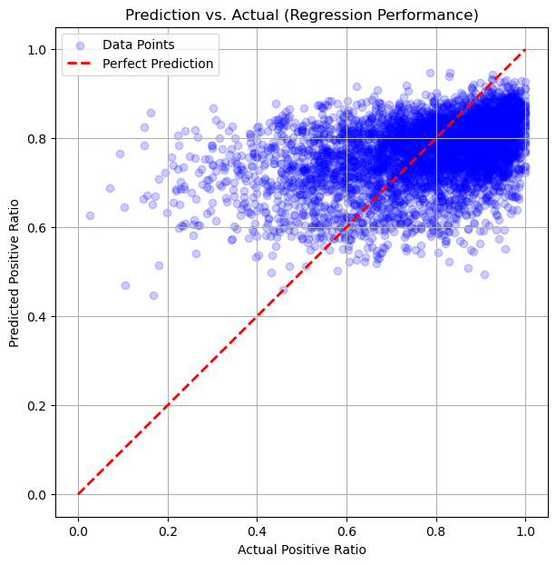
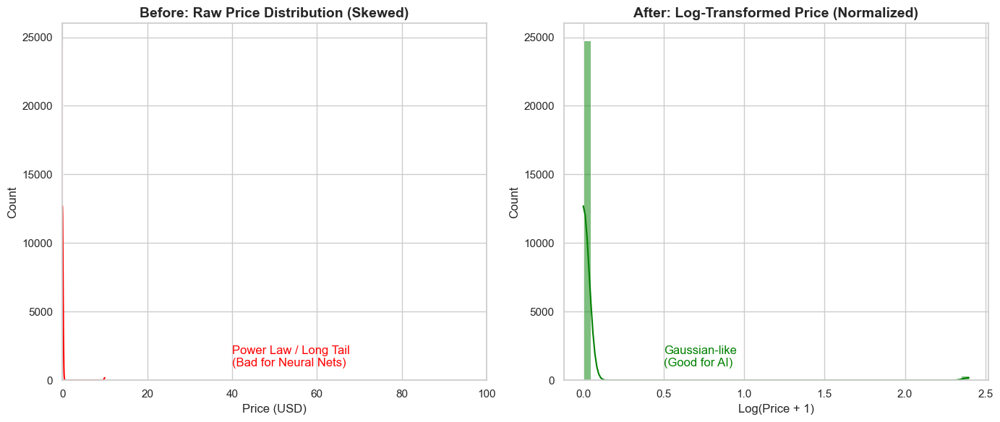
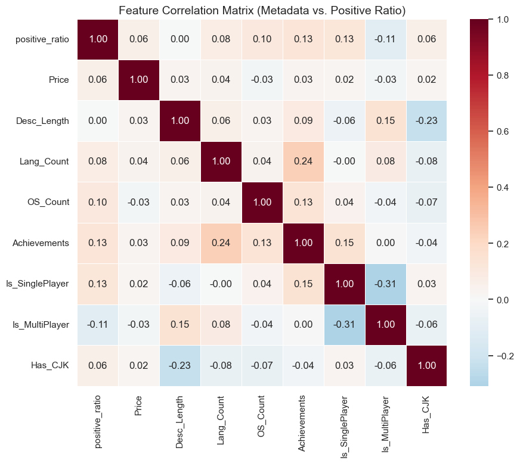

# 04 · Steam 游戏口碑预测

我想验证一个听起来很合理的假设:**能不能靠一款游戏的公开信息(价格、平台、语言、简介……),提前预测出它上线后的口碑?** 做完之后我的结论是:不行

## 一句话结论

我用 2.5 万款游戏训练了一个神经网络去预测好评率,最终只能解释约 **15.5%** 的口碑波动(R² = 0.155)。价格和好评率的相关性只有 **+0.06**,几乎为零。换句话说,"贵的游戏不一定好评高",口碑是被内容、玩法、社区这些数据里没有的东西决定的。

## 我从这个项目里学到的

我做了个模型预测游戏评分,模型训练出来后的真实情况是:好评率这个东西,靠元数据预测的天花板本来就很低。

- **价格几乎没有信号。** 相关系数 +0.06,基本等于噪声。任何"定价越高品质越好"的直觉在数据面前站不住脚。
- **单机游戏的好评率系统性地高于多人游戏**(+0.13 vs −0.11)。这个差异比价格大得多,更可能是因为多人游戏的口碑还绑着服务器、匹配、外挂这些运营变量。
- **描述长度和好评率的线性相关是 0.00。** 写得长没用,写了什么才有用。这也是我后来加 NLP 文本特征的理由。

## 我具体做了什么

原始数据是 Kaggle 的 Steam Games Dataset,11.1 万行、39 列。第一步是做数据体检,结果很脏:

- `Score rank` 缺失 99.96%,`Metacritic url` 缺 96.41%,`Reviews` 缺 90.47%,这几列直接丢掉。
- `Required age` 的最大值是 999.98,明显是录入错误,截断到 18。
- 官方给的 `User score` 列不可用(全表只有 44 个有效值,IQR 塌成 0),所以我自己用 `好评数 / (好评数 + 差评数)` 重构了一个可回归的目标变量 `Positive Ratio`。
- 评论数少于 50 的冷门游戏会让好评率剧烈抖动(1 条评论就能给出 100% 好评),全部过滤。最后留下 **25,127 条**可靠样本。

特征工程是这个项目里我花时间最多的地方,一共构造了 62 维:

- **基础元数据**:支持语言数(当作研发预算的代理变量)、单机/多人标记、成就数(取对数)。
- **商业洞察特征**:简介词数、跨平台支持数(Win/Mac/Linux 求和)、是否含中日韩字符(捕捉区域市场)。
- **NLP 语义特征**:把游戏名和简介拼接后做 TF-IDF,再用 SVD 压到 20 维稠密向量,让模型能"读懂"游戏在讲什么。
- 对 `Price`、`DiscountDLC count`、`Achievements` 这些幂律分布的列做了 `log1p` 变换,不然神经网络的梯度会被少数极大值带偏。

模型是一个 Keras MLP:62 → 128 →(Dropout 0.3)→ 64 → 32 → 1,输出层用 Sigmoid 把预测值卡在 0~1,共 18,305 个参数;Adam(lr=0.001),MSE 损失,batch 32,训 30 轮。验证损失稳定收敛在 0.023 附近,没有过拟合。

从只用价格和品类的基线(R² ≈ 0.07)到最终的 0.155,靠的是特征工程一点点堆出来的信号,不是模型本身有多聪明。

## 文件

| 文件 | 说明 |
|------|------|
| [`steam-rating-code.ipynb`](./steam-rating-code.ipynb) | 完整实现:数据体检、特征工程、建模、评估 |
| [`steam-rating-report.pdf`](./steam-rating-report.pdf) | 完整报告 |
| `assets/` | 关键图表 |

> 本项目为个人独立完成,包括数据清洗、特征工程、建模与结论。数据来自 Kaggle 公开数据集,不含隐私内容。
